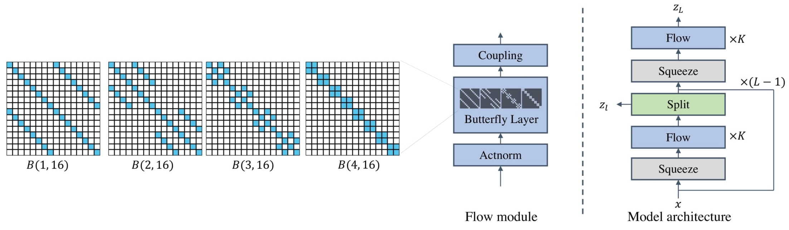

# ButterflyFlow: Building Invertible Layers with Butterfly Matrices 

Implementation for [ButterflyFlow: Building Invertible Layers with Butterfly Matrices](https://arxiv.org/pdf/2209.13774.pdf) 

Chenlin Meng*, Linqi Zhou*, Kristy Choi*, Tri Dao, Stefano Ermon (*equal contributions)

--------------------
We propose a new linear layer based on Butterfly Matrices for flow-based models. In particular, we show that our butterfly layer can better model data with structures such as permutation and periodicity in terms of bits-per-dimension (BPD) and negative-log-likelihood (NLL). An example of the design of a Butterfly layer and the overall architecture is shown below




--------------------
## Requirements

ButterflyFlow is built with Python 3.7, PyTorch 1.10 and CUDA 10.2. And additional packages can be installed with
```
pip install -r requirements.txt
```

## Data

In this repo, we present CIFAR10, [Galaxy Images](https://github.com/SpaceML/merger_transfer_learning), and [MIMIC-III Waveform Database](https://physionet.org/content/mimic3wdb/1.0/).

For Galaxy Images, please follow the above link for processing. For MIMIC-III data, the above link provides the complete patient waveform data. However, due to the large amount of waveforms, we only consider 3 patients and construct per-patient datasets for testing. We provide the extracted datasets at [this google drive link](https://drive.google.com/drive/folders/1pPqCIA_0i5NauaX4apCCiBw9CCH26zS6?usp=sharing).

## Configs

Default config files are located under `configs`, and within each file you can specify data path by modifying `data_path` entry.

## Training 


Training can be done via the following commands:
For CIFAR10 (with permutation):

```
python -u main_image.py --config configs/cifar10-permute-butterfly.json --exp_name cifar10_permute --batch_size 128 --n_bits 8 --dequant uniform
```
For CIFAR10:

```
python -u main_image.py --config configs/cifar10-butterfly.json --exp_name cifar10 --batch_size 128 --n_bits 8 --dequant uniform --no_data_permute
```
For Galaxy Images:

```
python -u main_image.py --config configs/galaxy-butterfly.json --exp_name galaxy --batch_size 64 --n_bits 8 --dequant uniform
```
For MIMIC Patient:

```
python -u main_patient.py --config configs/mimic-butterfly.json --exp_name mimic
```

## Reference

```
@inproceedings{meng2022butterflyflow,
  title={ButterflyFlow: Building Invertible Layers with Butterfly Matrices},
  author={Meng, Chenlin and Zhou, Linqi and Choi, Kristy and Dao, Tri and Ermon, Stefano},
  booktitle={International Conference on Machine Learning},
  pages={15360--15375},
  year={2022},
  organization={PMLR}
}
```